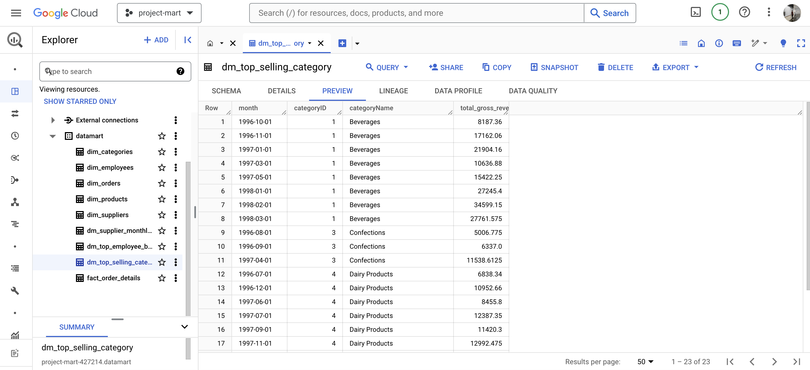

# ELT Pipeline from CSV to Postgres, PySpark Transformation, and Load to Google BigQuery

## Table of Contents

1. [Project Overview](#project-overview)
2. [Prerequisites](#prerequisites)
3. [Setup and Installation](#setup-and-installation)
   1. [Clone the Repository](#clone-the-repository)
   2. [Environment Variables](#environment-variables)
   3. [Docker Setup](#docker-setup)
4. [Usage](#usage)
   1. [Running the Pipeline](#running-the-pipeline)
5. [Project Structure](#project-structure)

## Project Overview

This project implements an ELT (Extract, Load, Transform) pipeline to process data from CSV files, load it into a PostgreSQL staging database, transform the data using PySpark, and finally load the transformed data into Google BigQuery. The pipeline is designed to handle large volumes of data efficiently, leveraging the scalability of PySpark and the robustness of Google BigQuery for analytics.




## Prerequisites

- Docker and Docker Compose
- PostgreSQL
- Apache Spark with PySpark
- Google Cloud SDK (for BigQuery)
- Python 3.8 or higher

## Setup and Installation

### Clone the Repository

```bash
git clone https://github.com/lanaahm/airflow-spark-bigquery.git
cd airflow-spark-bigquery
```

## Environment Variables

Create a .env file in the project root and add the following environment variables:

```env
GOOGLE_APPLICATION_CREDENTIALS=/path/to/your/bigquery/credentials.json
BQ_PROJECT_ID=your_bigquery_project_id
BQ_DATASET=your_bigquery_dataset
```

## Docker Setup

Build and run the Docker containers:

```bash
docker-compose up --build
```

## Usage

### Running the Pipeline

To run the entire ELT pipeline:

1. Start the Airflow web server and scheduler:

```bash
docker-compose up -d airflow-webserver airflow-scheduler
```

2.Trigger the pipeline DAG from the Airflow UI or run it manually using the following command:

```bash
docker-compose exec airflow-webserver airflow dags trigger your_dag_id
```

Project Structure

```
etl-spark-biquery/
│
├── airflow/
│   ├── dags/
│   │   ├── utils/
│   │   │   ├── config.py
│   │   │   ├── extract_to_staging.py
│   │   ├── spark_airflow.py
│   ├── logs/
│   ├── output/
│   ├── .env
│   ├── Dockerfile
│
├── postgres/
│   ├── initdb.sql
│
├── spark/
│   ├── jobs/
│   │   ├── hello_world_spark.py
│   │   ├── supplier_monthly_revenue.py
│   │   ├── top_employee_by_revenue.py
│   │   ├── top_selling_category.py
│   ├── notebooks/
│   │   ├── hello_world_spark.ipynb
│   │   ├── supplier_monthly_revenue.ipynb
│   │   ├── top_employee_by_revenue.ipynb
│   │   ├── top_selling_category.ipynb
│   ├── resources/
│   │   ├── jars/
│   │   │   ├── postgresql-42.7.3.jar
│
├── .dockerignore
├── .editorconfig
├── .gitignore
├── docker-compose.yml
└── README.md
```

- etl-spark-biquery/: The root directory for the entire project.
- airflow/: Contains the Airflow configuration, DAGs, and utility scripts.
- postgres/: Contains PostgreSQL initialization scripts.
- spark/: Contains PySpark jobs and Jupyter notebooks for data transformation testing.
- .dockerignore: Specifies files and directories to ignore in Docker builds.
- .editorconfig: Defines coding styles for the project.
- .gitignore: Specifies files and directories to ignore in Git.
- docker-compose.yml: Docker Compose configuration file for setting up the environment.
- README.md: Project documentation file.

This README provides a comprehensive overview of the project and should help you get started quickly.
